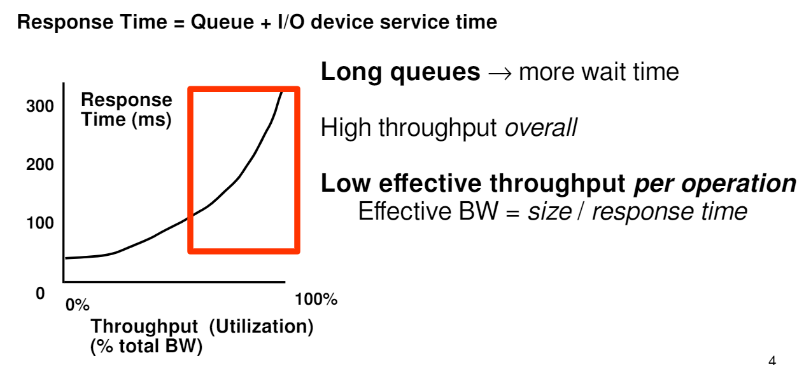
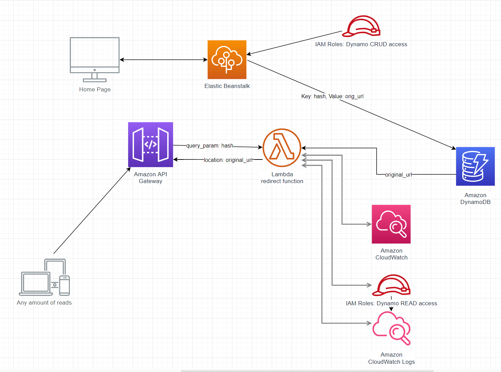

## SAM URL (Tiny-url clone made with flask and AWS Lambda!!)
This guide will take you through a common interview question and is heavily inspired by a [this educative system interview design article](https://www.educative.io/courses/grokking-the-system-design-interview/m2ygV4E81AR)

### The Problem
URL shortening is a service to create an alias from a really long url to a shorter one i.e: https://www.google.com/maps/place/Stanford+University/@37.4249706,-122.1878931,14z/data=!4m8!1m2!2m1!1sstanford!3m4!1s0x0:0x29cdf01a44fc687f!8m2!3d37.4274762!4d-122.1697176 -> http://tinyurl.com/<short-hash>. Short links are used to save space in loads of character limited text boxes like twitter, job applications, printed message boards. Especially if the message board is printed, people are less likely to erroneously enter the url into their browsers.

### Requirements

   #### Functional
   1. Given an url, our service should create a shorter url that performs a 302(redirect) to the original, longer url.
   
   #### Non-functional (Performance!!)
   1. Our service should be highly available. At any given moment in time, a user should be able to call our redirect link and be able to get a redirect. If our service is down, a whole lot of peoples redirects will start failing instantly. This means we need a really reliable service that we know won't crash under strenuous loads or have periodic maintenence times, etc.
   2. URL redirection needs to happen in real-time and really quickly. Always. Regardless of the type of machine we call it on or how many people are concurrently calling the same link, we should be able to get to our original url really quickly (within about 1/2 a second would be nice).
   3. We shouldn't have collisions in our link (every link should be unique and not guessable)

### Proposed architecture
Now that we have the scope of our problem, lets create an architecture to solve this problem. 
   -  The hardest part of our performance constraint will be to keep our redirect function highly available and low latency.
Consider an instance where you shorten a link to a shocking College ranking list that shows Berkeley having a higher rank
than Stanford (as it should be). You share it on Twitter and it instantly goes viral. In an instant we now have 1 million hits. 
We could provision a massive server to handle all of our requests but that has several downsides. For one, we would have 
to administer that server(S). This means we'd have to do everything IT does: configure VPC's, constant monitoring, server maintenance.
Not to mention that a majority of the time our server would be at a fraction of its capacity. If for some reason, our we exceed
our server work load we will see this sort of behavior (Little's Law). [credit](https://inst.eecs.berkeley.edu/~cs162/su15/static/lectures/23.pdf).
Where our response time goes up exponentially, and eventually everyone's redirects will time out.  Autoscaling clusters
scale far to slowly for such sporadic workloads.
   - Here is the architecture that we will be implementing:. Let's go through it step by step!
      - [*Elastic Beanstalk*](https://docs.aws.amazon.com/elasticbeanstalk/latest/dg/Welcome.html): This service is essentially PaaS(Platform as a Service). What this means, is that Amazon will
   take care of provisioning a public DNS for our web app, Autoscaling clusters to handle the application, and CloudWatch
   to monitor our production environment.
     - [*DynamoDB*](https://www.alexdebrie.com/posts/dynamodb-single-table/): This is going to be our data storage solution. DynamoDB is a noSQL database that is perfect for our simple 
   schema. Essentially all we want to store is our generated hash as a key, and the original url as the value. By choosing
    noSQL, we are saying that performance is extremely important to us and that the majority of our queries will be simple.
    This means we are making a commitment to keep our schema really simple and giving up a lot of efficient querying techniques that
    a traditional DBMS would provide for us. Since we are only anticipating doing sporadic single gets, this is perfect four our use case.
     - [*Lambda*](https://www.serverless.com/aws-lambda): This is the **serverless** option that will process every redirect request. Everytime a user enters a redirect url
   into their browser, they will be calling this service. Without getting into too much detail, we can think of Lambda as 
   essentially spawning a computer/VM to handle a single request, that is then immediately destroyed after the request is done
    (so state is **not** preserved). Think Docker!
     - [*API Gateway*](https://www.alexdebrie.com/posts/api-gateway-elements/): We can access our Lambda function through a variety of [*triggers*](https://docs.aws.amazon.com/lambda/latest/dg/lambda-invocation.html).
    API Gateway is one such trigger. In short, API Gateway allows us to call our function via the open web. It will provide a 
    DNS for our trigger and a route. Then API Gateway will speak to lambda with an [*event*](https://docs.aws.amazon.com/lambda/latest/dg/services-apigateway.html).
    Lambda will consume that event and give API Gateway a response after it has done the necessary computation. If API Gateway
    can't understand the response from Lambda, then it will throw a 502, you won't know why, and we will be sad. If it can understand the response,
    then it will package it back up and deliver it to the user that called it.
    
      

For more details see [GitHub Flavored Markdown](https://guides.github.com/features/mastering-markdown/).

### Jekyll Themes

Your Pages site will use the layout and styles from the Jekyll theme you have selected in your [repository settings](https://github.com/abhinavDhulipala/CLurKel/settings/pages). The name of this theme is saved in the Jekyll `_config.yml` configuration file.

### Support or Contact

Having trouble with Pages? Check out our [documentation](https://docs.github.com/categories/github-pages-basics/) or [contact support](https://support.github.com/contact) and we’ll help you sort it out.
